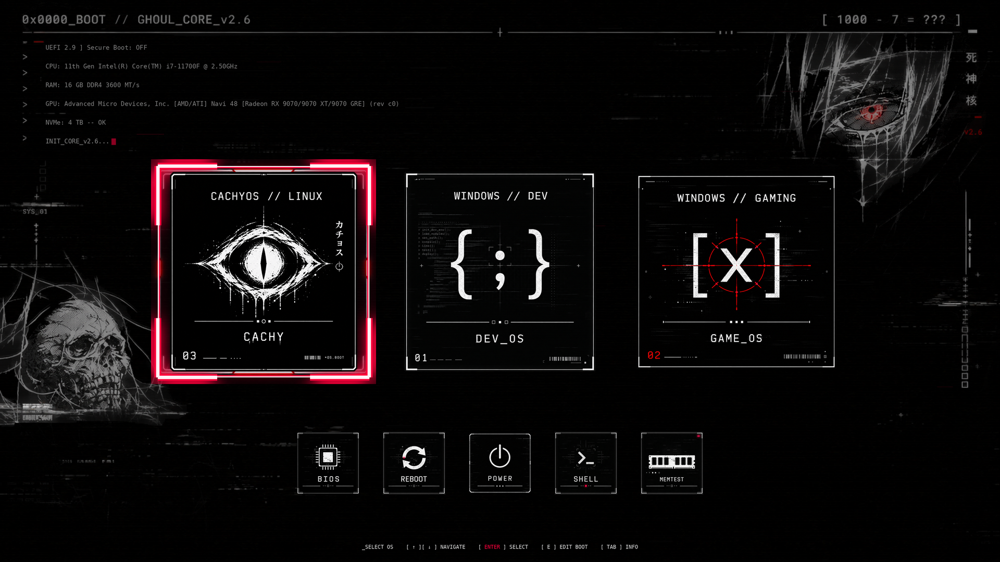

# Ghoul Cyber – rEFInd Bootloader Theme

> **Nowoczesny, cyberpunkowy motyw dla bootloadera rEFInd zaprojektowany z myślą o panelach 4K OLED / QHD / FHD z automatyczną detekcją i wdrożeniem.**



---

## ☕ Wesprzyj projekt (Support the Author)

Jeśli motyw przypadł Ci do gustu, świetnie wygląda na Twoim ekranie lub zaoszczędził Ci konfiguracji – możesz docenić pracę i postawić wirtualną kawę:

[-37AC49?style=for-the-badge&logo=buy-me-a-coffee&logoColor=white)](https://buycoffee.to/dismonder)
[](https://ko-fi.com/dismonder)
[](https://patronite.pl/Dismonder)
[](https://github.com/sponsors/Dismonder)

- 🇵🇱 **[BuyCoffee.to/dismonder](https://buycoffee.to/dismonder)** – szybka kawa w PLN (BLIK, karta, Apple Pay / Google Pay).
- 🌍 **[Ko-fi.com/dismonder](https://ko-fi.com/dismonder)** – wsparcie zagraniczne (PayPal / karty, 0% prowizji platformy).
- 🏆 **[Patronite.pl/Dismonder](https://patronite.pl/Dismonder)** – comiesięczne wsparcie patronackie / subskrypcja.
- 🐙 **[GitHub Sponsors (Dismonder)](https://github.com/sponsors/Dismonder)** – bezpośredni program sponsoringu GitHub (profil zgłoszony do weryfikacji).

---

## 👤 Autor i Podpis (Author & Signature)

- **Autor / Creator:** **Dismonder**
- **Copyright:** © 2026 Dismonder. Wszystkie prawa zastrzeżone / All Rights Reserved.
- **Licencja:** [Ghoul Cyber Protective License (GCPL-1.0)](LICENSE)

---

## 📜 Licencja (License Summary)

Projekt objęty jest dedykowaną licencją ochronną **GCPL-1.0 (Ghoul Cyber Protective License)**:

✅ **Co MOŻESZ robić:**
- Bezpłatnie pobierać, instalować i używać motywu na własnych urządzeniach (komputery stacjonarne, laptopy, konsole handheld).
- Modyfikować pliki i konfigurację na własny, prywatny użytek (np. własne rozdzielczości, własne etykiety EFI).

❌ **Czego KATEGORYCZNIE NIE WOLNO robić:**
- **ZAKAZ ROZPOWSZECHNIANIA POD WŁASNYMI INICJAŁAMI / NAZWISKIEM:** Zabrania się publikowania, udostępniania i re-uploadu motywu pod własnym nazwiskiem, inicjałami, pseudonimem, marką lub jako rzekomo własnego projektu (bezwzględny zakaz przywłaszczania autorstwa).
- **ZAKAZ USUWANIA DANYCH AUTORA:** Zabrania się usuwania lub zamazywania podpisu, pseudonimu `Dismonder`, not prawno-autorskich i pliku licencji z kodu, plików konfiguracyjnych i dokumentacji.
- **ZAKAZ UŻYTKU KOMERCYJNEGO:** Zabrania się sprzedaży motywu, pobierania za niego opłat lub dołączania go do płatnych pakietów komercyjnych bez pisemnej zgody autora.

Pełny, prawnie wiążący tekst licencji w języku polskim i angielskim znajduje się w pliku [LICENSE](LICENSE).

---

## 🎮 Kluczowe cechy (Features)

- **Natywna geometria 4K UHD (3840×2160):**
  - Duże ikony systemowe 768×768 px (idealne na ekrany 4K / OLED).
  - Narzędzia funkcyjne 240×240 px, ramki wyboru 864×864 px / 270×270 px.
  - Obsługa rozdzielczości 1440p (2560×1440) oraz 1080p (1920×1080) i innych formatów 16:9.
- **W pełni zautomatyzowany instalator (`build_and_deploy_theme.py`):**
  - **Linux (CachyOS / Arch / inne):** Pełny automat — wykrywa instalację rEFInd na ESP, mapuje wpisy UEFI NVRAM na właściwe karty rozruchowe (*Windows DEV*, *Windows Gaming*, *CachyOS*), instaluje assety do `/boot/efi/EFI/refind/themes/ghoul-cyber` i bezpiecznie aktualizuje `refind.conf` (z transakcyjnym backupem i rollbackiem).
  - **Windows:** Tryb build-only generujący gotową paczkę do katalogu `dist/ghoul-cyber`.
- **Generator assetów z dynamiczną telemetrią:**
  - Automatyczne nakładanie informacji o procesorze (CPU), pamięci RAM, karcie graficznej (GPU), dysku NVMe i stanie Secure Boot na tapetę tła.
  - Generowanie kompletnego zestawu ikon narzędziowych i systemowych (Windows, CachyOS, Linux, Arch, Debian, Ubuntu, Fedora, macOS i inne).

---

## 🚀 Szybki start (Quick Start)

### 1. Wdrożenie na CachyOS / Linux (automatyczne)
Uruchomienie skryptu bez argumentów wykonuje pełną detekcję, budowę motywu 4K oraz aktywację w rEFInd:

```bash
python3 build_and_deploy_theme.py
```

*Skrypt w razie potrzeby zapyta o hasło `sudo` do operacji na partycji ESP i automatycznie uzupełni brakujące pakiety (`python-pillow`, `efibootmgr`, fonty).*

### 2. Budowa samej paczki motywu (Build-Only / Windows)
Na systemie Windows lub gdy chcesz jedynie wygenerować pliki motywu bez dotykania partycji rozruchowej ESP:

```bash
python3 build_and_deploy_theme.py --build-only
```
Pliki trafią do katalogu `dist/ghoul-cyber/`.

### 3. Tryb symulacji (Dry-Run)
Pozwala sprawdzić zaplanowane działania, odczytać telemetrię i zbadać loader rEFInd bez wprowadzania jakichkolwiek zmian:

```bash
python3 build_and_deploy_theme.py --dry-run
```

---

## ⚙️ Najważniejsze parametry CLI

| Parametr | Opis |
| :--- | :--- |
| `--resolution WIDTHxHEIGHT` | Rozdzielczość docelowa (domyślnie `3840x2160`, wspierane także `2560x1440`, `1920x1080`) |
| `--build-only` | Generuje motyw do `dist/` bez ingerencji w ESP i konfigurację rEFInd |
| `--dry-run` | Sprawdza środowisko i wypisuje planowane operacje bez modyfikowania dysku |
| `--source-dir PATH` | Ścieżka do katalogu z surowymi grafikami źródłowymi |
| `--output-dir PATH` | Ścieżka wyjściowa dla wygenerowanego motywu |
| `--refind-dir PATH` | Ścieżka do katalogu rEFInd na zamontowanej partycji ESP |
| `--cpu`, `--gpu`, `--ram`, `--nvme` | Ręczne nadpisanie danych telemetrycznych wypisywanych na tapecie |
| `--secure-boot {auto,on,off}` | Ręczne ustawienie wskaźnika Secure Boot |
| `--font PATH` | Ścieżka do własnego pliku fontu TTF/OTF |

---

## 🧪 Testy (Test Suite)

Projekt posiada zestaw testów jednostkowych pokrywających kontrakt budowania, geometrię assetów, transakcyjność zapisu ESP i parsowanie UEFI:

```bash
python3 -m pytest tests
```
