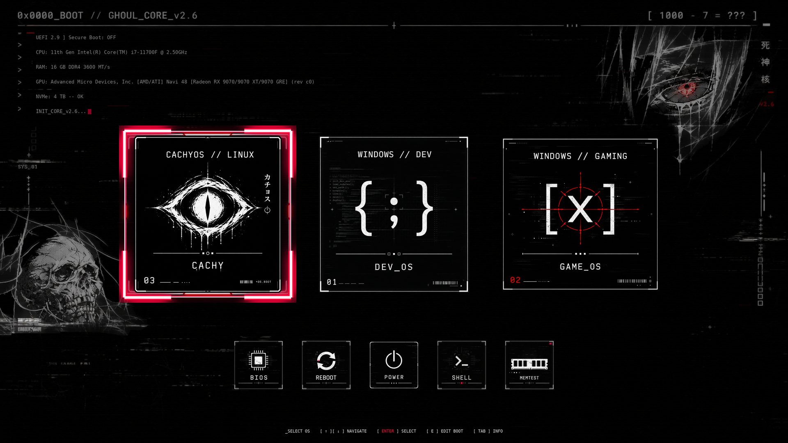

# Ghoul Cyber – rEFInd Bootloader Theme

[🇬🇧 English](README.md) | **🇵🇱 Polski**

> **Nowoczesny, cyberpunkowy motyw dla bootloadera rEFInd zaprojektowany z myślą o panelach 4K OLED / QHD / FHD z automatyczną detekcją i wdrożeniem.**

[](https://github.com/Dismonder/refind-theme-ghoul-cyber/releases)
[](LICENSE)



---

## ☕ Wesprzyj projekt (Support the Author)

Jeśli motyw przypadł Ci do gustu, świetnie wygląda na Twoim ekranie lub zaoszczędził Ci konfiguracji – możesz docenić pracę i postawić wirtualną kawę:

[-37AC49?style=for-the-badge&logo=buy-me-a-coffee&logoColor=white)](https://buycoffee.to/dismonder)
[](https://ko-fi.com/dismonder)
[](https://patronite.pl/Dismonder)
[](https://github.com/sponsors/Dismonder)

- 🇵🇱 **[BuyCoffee.to/dismonder](https://buycoffee.to/dismonder)** – szybka kawa w PLN (BLIK, karta, Apple Pay / Google Pay).
- 🌍 **[Ko-fi.com/dismonder](https://ko-fi.com/dismonder)** – wsparcie zagraniczne (PayPal / karty, 0% prowizji platformy).
- 🏆 **[Patronite.pl/Dismonder](https://patronite.pl/Dismonder)** – comiesięczne wsparcie patronackie / subskrypcja.
- 🐙 **[GitHub Sponsors (Dismonder)](https://github.com/sponsors/Dismonder)** – bezpośredni program sponsoringu GitHub.

---

## 👤 Autor i Podpis (Author & Signature)

- **Autor / Creator:** **Dismonder**
- **Wydania / Releases:** [Releases](https://github.com/Dismonder/refind-theme-ghoul-cyber/releases)
- **Copyright:** © 2026 Dismonder. Wszystkie prawa zastrzeżone / All Rights Reserved.
- **Licencja:** [Ghoul Cyber Protective License (GCPL-1.0)](LICENSE)

---

## 📜 Licencja (License Summary)

Projekt objęty jest dedykowaną licencją ochronną **GCPL-1.0 (Ghoul Cyber Protective License)**:

✅ **Co MOŻESZ robić:**
- Bezpłatnie pobierać, instalować i używać motywu na własnych urządzeniach (komputery stacjonarne, laptopy, konsole handheld).
- Modyfikować pliki i konfigurację na własny, prywatny użytek (np. własne rozdzielczości, własne etykiety EFI).

❌ **Czego KATEGORYCZNIE NIE WOLNO robić:**
- **ZAKAZ ROZPOWSZECHNIANIA POD WŁASNYMI INICJAŁAMI / NAZWISKIEM:** Zabrania się publikowania, udostępniania i re-uploadu motywu pod własnym nazwiskiem, inicjałami, pseudonimem, marką lub jako rzekomo własnego projektu (bezwzględny zakaz przywłaszczania autorstwa).
- **ZAKAZ USUWANIA DANYCH AUTORA:** Zabrania się usuwania lub zamazywania podpisu, pseudonimu `Dismonder`, not prawno-autorskich i pliku licencji z kodu, plików konfiguracyjnych i dokumentacji.
- **ZAKAZ UŻYTKU KOMERCYJNEGO:** Zabrania się sprzedaży motywu, pobierania za niego opłat lub dołączania go do płatnych pakietów komercyjnych bez pisemnej zgody autora.

Pełny, prawnie wiążący tekst licencji w języku polskim i angielskim znajduje się w pliku [LICENSE](LICENSE).

---

## 🎮 Kluczowe cechy (Features)

- **Natywna geometria 4K UHD (3840×2160):**
  - Duże ikony systemowe 768×768 px (idealne na ekrany 4K / OLED).
  - Narzędzia funkcyjne 240×240 px, ramki wyboru 864×864 px / 270×270 px.
  - Obsługa rozdzielczości 1440p (2560×1440) oraz 1080p (1920×1080) i innych formatów 16:9.
- **W pełni zautomatyzowany instalator (`build_and_deploy_theme.py`):**
  - **Linux (każda popularna dystrybucja):** Pełny automat — doinstalowuje brakujące pakiety menedżerem pakietów Twojej dystrybucji, sam instaluje rEFInd, jeśli go brakuje (po zapytaniu), mapuje wpisy UEFI NVRAM na właściwe karty rozruchowe (*Windows DEV*, *Windows Gaming*, *CachyOS* — każdą tylko jeśli ją masz; komputer z samym Linuksem też jest OK), instaluje assety do `/boot/efi/EFI/refind/themes/ghoul-cyber` i bezpiecznie aktualizuje `refind.conf` (z transakcyjnym backupem i rollbackiem).
  - **Windows:** Tryb build-only generujący gotową paczkę do katalogu `dist/ghoul-cyber`.
- **Generator assetów z dynamiczną telemetrią:**
  - Automatyczne nakładanie informacji o procesorze (CPU), pamięci RAM, karcie graficznej (GPU), dysku NVMe i stanie Secure Boot na tapetę tła.
  - Generowanie kompletnego zestawu ikon narzędziowych i systemowych (Windows, CachyOS, Linux, Arch, Debian, Ubuntu, Fedora, macOS i inne).

---

## ✅ Wymagania (Requirements)

| | Wymaganie |
| :--- | :--- |
| Firmware | Rozruch w trybie **UEFI** (nie Legacy BIOS / CSM) — sprawdzisz przez `ls /sys/firmware/efi/efivars` |
| Linux | Każda dystrybucja z `pacman` (Arch, CachyOS, EndeavourOS, Manjaro), `apt` (Debian, Ubuntu, Mint, Pop!_OS), `dnf` (Fedora), `zypper` (openSUSE), `xbps` (Void) albo `apk` (Alpine) — brakujące pakiety instalują się same |
| Python | **Python 3** (Pillow na Linuksie doinstaluje się sam) |
| Bootloader | **rEFInd** — jeśli go nie ma, instalator zaproponuje, że zainstaluje go za Ciebie |

### Nie masz jeszcze rEFInd?

Nic nie musisz robić ręcznie: gdy rEFInd nie zostanie znaleziony, instalator zapyta *„rEFInd is not installed. Install it now?”*, zainstaluje pakiet z Twojej dystrybucji i uruchomi `refind-install` (dotychczasowy bootloader zostaje w menu firmware). Flaga `--install-refind` pomija pytanie.

| Sytuacja | Co się dzieje |
| :--- | :--- |
| Komputer uruchomiony w trybie legacy BIOS / CSM | zatrzymuje się z wyjaśnieniem — rEFInd wymaga UEFI |
| **Włączony Secure Boot** | zatrzymuje się z wyjaśnieniem — niepodpisany rEFInd by nie wystartował; wyłącz Secure Boot albo zainstaluj rEFInd z shim/MOK samodzielnie |
| openSUSE | rEFInd nie ma w oficjalnych repozytoriach — instalator wskaże [oficjalne pobieranie](https://www.rodsbooks.com/refind/getting.html) |
| Brak Windowsa / inny Linux niż CachyOS | bez problemu — motyw się instaluje, a rEFInd sam dobiera ikony (`os_linux`, `os_ubuntu`, `os_fedora`, …) |

Instalator szuka rEFInd w `/boot/EFI/refind`, `/boot/efi/EFI/refind`, `/efi/EFI/refind` oraz na każdej zamontowanej partycji (albo podaj `--refind-dir`).

---

## 🚀 Szybki start (Quick Start)

> 📦 **Gotowe wydania:** Gotowe, spakowane archiwa motywu (4K / 1440p / 1080p) i instalatora możesz również pobrać bezpośrednio z zakładki **[Releases](https://github.com/Dismonder/refind-theme-ghoul-cyber/releases)**.

### 1. Pobranie repozytorium

```bash
git clone https://github.com/Dismonder/refind-theme-ghoul-cyber.git
cd refind-theme-ghoul-cyber
```

### 2. Tryb symulacji (Dry-Run) — zalecany
Pozwala sprawdzić zaplanowane działania, odczytać telemetrię i zbadać loader rEFInd bez wprowadzania jakichkolwiek zmian:

```bash
python3 build_and_deploy_theme.py --dry-run
```

Jeśli masz dwie instalacje Windows, skrypt zapyta, która z nich to *DEV*. Na końcu wypisze plan wdrożenia (który wpis dostanie którą ikonę i gdzie leży rEFInd).

### 3. Wdrożenie na CachyOS / Linux (automatyczne)
Uruchomienie skryptu bez argumentów wykonuje pełną detekcję, budowę motywu 4K oraz aktywację w rEFInd:

```bash
python3 build_and_deploy_theme.py
```

*Skrypt w razie potrzeby zapyta o hasło `sudo` (tylko do zapisu na ESP) i automatycznie uzupełni brakujące pakiety (`python-pillow`, `efibootmgr`, fonty).* Po restarcie nowy motyw jest aktywny.

### 4. Budowa samej paczki motywu (Build-Only / Windows)
Na systemie Windows lub gdy chcesz jedynie wygenerować pliki motywu bez dotykania partycji rozruchowej ESP:

```bash
python3 build_and_deploy_theme.py --build-only
```
Pliki trafią do katalogu `dist/ghoul-cyber/`.

---

## 🪟 Ręczna instalacja na Windowsie

Na Windowsie skrypt nigdy nie dotyka partycji rozruchowej. Zbuduj paczkę (`py build_and_deploy_theme.py --build-only`) **albo** pobierz gotowe archiwum `ghoul-cyber-v*.zip` z [Releases](https://github.com/Dismonder/refind-theme-ghoul-cyber/releases), a następnie w terminalu **uruchomionym jako administrator**:

```powershell
mountvol S: /S
robocopy dist\ghoul-cyber S:\EFI\refind\themes\ghoul-cyber /E
notepad S:\EFI\refind\refind.conf
mountvol S: /D
```

W `refind.conf` dopisz na samym końcu:

```
include themes/ghoul-cyber/theme.conf
```

> 💡 Przy ręcznej instalacji zajrzyj też do `themes/ghoul-cyber/theme.conf`: linijka `resolution` musi pasować do Twojego monitora, a przykładowy blok `menuentry "Windows 11 Gaming"` możesz usunąć albo dostosować do swoich dysków.

---

## ⚙️ Najważniejsze parametry CLI

| Parametr | Opis |
| :--- | :--- |
| `--resolution WIDTHxHEIGHT` | Rozdzielczość docelowa (domyślnie `3840x2160`, wspierane także `2560x1440`, `1920x1080`) |
| `--build-only` | Generuje motyw do `dist/` bez ingerencji w ESP i konfigurację rEFInd |
| `--dry-run` | Sprawdza środowisko i wypisuje planowane operacje bez modyfikowania dysku |
| `--non-interactive` | Kończy się błędem zamiast pytać, która instalacja Windows to DEV |
| `--install-refind` | Linux: zainstaluj rEFInd bez pytania, jeśli go brakuje |
| `--source-dir PATH` | Ścieżka do katalogu z surowymi grafikami źródłowymi |
| `--output-dir PATH` | Ścieżka wyjściowa dla wygenerowanego motywu |
| `--refind-dir PATH` | Ścieżka do katalogu rEFInd na zamontowanej partycji ESP |
| `--cpu`, `--gpu`, `--ram`, `--nvme` | Ręczne nadpisanie danych telemetrycznych wypisywanych na tapecie |
| `--secure-boot {auto,on,off}` | Ręczne ustawienie wskaźnika Secure Boot |
| `--font PATH` | Ścieżka do własnego pliku fontu TTF/OTF |
| `--theme NAZWA` | Motyw wizualny z katalogu `themes/` (domyślnie `ghoul-cyber`) |
| `--list-themes` | Wypisuje dostępne motywy |
| `--config ŚCIEŻKA` | Plik ustawień (domyślnie `boot-config.json` obok skryptu, jeśli istnieje) |
| `--check-config` | Sprawdza ustawienia i pokazuje wygenerowany `theme.conf` |
| `--install` | Windows: po zbudowaniu instaluje motyw w rEFInd (pyta o UAC) |

---

## 🖥️ Theme Studio — własny ekran startowy w kilka chwil

**Theme Studio** — aplikacja, w której wybierasz motyw, dopasowujesz go z **podglądem na żywo** i budujesz albo instalujesz jednym kliknięciem (polski / angielski, Linux i Windows) — ma własne repozytorium i używa tego jako silnika:

### 👉 [Dismonder/ghoul-cyber-theme-studio](https://github.com/Dismonder/ghoul-cyber-theme-studio) · [⬇️ pobierz](https://github.com/Dismonder/ghoul-cyber-theme-studio/releases/latest)

Wszystko, co robi, jest też dostępne z wiersza poleceń tego repozytorium (`build_and_deploy_theme.py`, ustawienia w `boot-config.json` — niżej).

---

## 🧩 Personalizacja (`boot-config.json`)

Jeden plik JSON steruje układem, tym, co się wyświetla, i zachowaniem rEFInd. Theme Studio zapisuje go za Ciebie; możesz też edytować go ręcznie — wystarczy wpisać tylko zmienione wartości. Przykład: [`boot-config.example.json`](boot-config.example.json).

| Sekcja | Co można zmienić |
| :--- | :--- |
| `layout` | rozdzielczość ekranu (ikony skalują się same), ile kafelków systemów widać naraz (reszta przewija się o jeden), strzałki przewijania (domyślnie wyłączone), rozmiar kafelków i ikon narzędzi, wielkość ramki zaznaczenia, skala i jasność grafiki, przyciemnienie grafiki pod interfejsem |
| `hud` | kolor akcentu, tytuł / hasło / kolumna znaków (włącz/wyłącz i własny tekst), które wiersze sprzętu, do 4 własnych wierszy, wiersz statusu i jego tekst, ozdobniki, pasek podpowiedzi, linie skanowania, paski glitch, oryginalna nakładka Ghoul |
| `cards` | numery na kafelkach systemów (włącz/wyłącz) i ich kolejność (puste = automatycznie: najpierw Twoje wpisy menu, potem systemy wykryte na tym komputerze; kafelki spoza listy nie dostają numeru) |
| `refind` | czas do startu, domyślny wpis (`+` = ostatnio uruchomiony), ile najwyżej narzędzi w dolnym rzędzie (najważniejsze pierwsze — rEFInd nie przewija tego rzędu), które narzędzia (domyślnie: BIOS, restart, wyłączenie, informacje, kolejność rozruchu, ukryte wpisy + każde narzędzie, które istnieje), dodatkowe narzędzia doinstalowywane z pakietów dystrybucji do `EFI/tools` (EFI Shell: Arch/CachyOS, Debian/Ubuntu; MemTest86+: Arch, Debian/Ubuntu — CachyOS nie ma wersji EFI), ukryte elementy, gdzie szukać systemów, mysz / dotyk, pomijane katalogi i pliki, maks. liczba wpisów |
| `entries` | własne wpisy menu: nazwa, kafelek (`cachyos`, `win_dev`, `win_game`, `windows`, `linux`, …), loader EFI, partycja i opcje jądra |

```bash
python3 build_and_deploy_theme.py --check-config          # sprawdź + pokaż wygenerowany theme.conf
python3 build_and_deploy_theme.py --config moj-wyglad.json # użyj innego pliku ustawień
```

Każda wartość jest sprawdzana (typ, zakres, dozwolone znaki), zanim cokolwiek zostanie zbudowane, a plik leżący obok skryptu jest wczytywany automatycznie.

> 🔢 Numery nie są już „wypalone” w kafelkach: builder znajduje numer namalowany na karcie, zamalowuje go i rysuje właściwy (w tym samym miejscu, rozmiarze, grubości i kolorze) — komputer z samym Linuksem dostanie `01`, a nie `03`.

> 🐧 Każdy motyw ma też ogólny kafelek **LINUX** (`card_linux.png` → `icons/os_linux.png`) dla dystrybucji innych niż CachyOS; `card_linux_gnu.png` zostaje jako wcześniejszy wariant „GNU // LINUX”.

> ℹ️ Wcześniejsze wersje miały na sztywno wpis `Windows 11 Gaming` wskazujący jeden konkretny dysk. Został usunięty — jeśli go potrzebujesz, dodaj własny w **Wpisy menu** (albo `entries`).

---

## 🎨 Alternatywne motywy

Oprócz oryginalnego Ghoul Cyber w repozytorium jest siedemnaście wariantów OLED inspirowanych anime i grami. Każdy ma własną grafikę AI, własne kafelki systemów i własny kolor akcentu. Instalator, telemetria i układ rEFInd są wspólne, a motyw zawsze instaluje się jako `themes/ghoul-cyber`.

> 🎭 **Fan art.** Tych siedemnaście motywów to nieoficjalny, niekomercyjny fan art inspirowany popularnymi anime i grami — niepowiązany z twórcami ani właścicielami praw i niewspierany przez nich; wszystkie postacie i znaki towarowe należą do ich właścicieli. Theme Studio oznacza je jako *FAN ART*. Właściciele praw mogą poprosić o usunięcie przez zgłoszenie (issue) — zobacz [`themes/FAN-ART.md`](themes/FAN-ART.md).

| Motyw | Akcent | Klimat |
| :--- | :--- | :--- |
| `cursed-domain` | fiolet `#A020F0` | okultystyczna magia, przeklęta energia, zniszczone torii |
| `chainsaw-devil` | pomarańcz `#FF6A00` | horror łowców diabłów, piły łańcuchowe, rozbryzgi tuszu |
| `titan-fall` | bursztyn `#FFB21A` | gigant zza muru, żołnierz na linkach |
| `mecha-unit` | zieleń `#7CFF3A` | biomechaniczne mecha z lat 90., heksagonalny HUD |
| `demon-blade` | cyjan `#2BB8FF` | szermierz z ery Taisho, wodny smok ukiyo-e, glicynia |
| `neon-ronin` | magenta `#FF2E97` | cyberpunkowy ronin w masce oni, neonowy deszcz |
| `void-horizon` | złoto `#FFC24B` | czarna dziura, samotny astronauta |
| `shadow-monarch` | indygo `#5B6CFF` | władca cieni, portal do lochu |
| `dragon-ki` | żółć `#FFE23B` | sztuki walki, aura ki, błyskawice |
| `soul-reaper` | mięta `#19FFC2` | pęknięta maska hollow, wielki miecz, czarne motyle |
| `frost-mage` | lodowy błękit `#9FE8FF` | elfia czarodziejka, lodowy krąg magiczny, ośnieżone ruiny |
| `sakura-storm` | róż `#FF8FC7` | samuraj pod pełnią księżyca, burza płatków wiśni |
| `elden-lord` | złoto `#E8B84A` | rycerz w stylu souls, złote drzewo, łaska |
| `night-city` | żółty `#FCEE0A` | cyberpunkowy najemnik, kurtka z żółtym kołnierzem, megamiasto, glitch |
| `hell-slayer` | piekielny `#FF4A1C` | opancerzony pogromca demonów, czaszki, lawa |
| `hollow-vessel` | barwinek `#A8B8FF` | mały rogaty rycerz, jaskinie królestwa owadów, ławka |
| `wolf-witcher` | srebro `#D9E1EC` | siwowłosy łowca potworów, medalion wilka, dwa miecze |

```bash
python3 build_and_deploy_theme.py --theme cursed-domain
```

Podgląd każdego motywu znajdziesz w `themes/<nazwa>/preview.jpg`. Własny motyw tworzysz, dodając folder `themes/<nazwa>/` z plikiem `art.png`/`art.jpg` (16:9, grafika w prawym górnym i lewym dolnym rogu na czystej czerni), opcjonalnym zestawem kafelków `selection_item_linux/windev/wingame.png` i plikiem `theme.json`:

```json
{ "accent": "#A020F0", "title": "CURSED_DOMAIN_v1.0", "kanji": "呪術核", "tagline": "[ DOMAIN :: EXPANSION ]", "art_brightness": 1.0 }
```

---

## 🛠️ Rozwiązywanie problemów

**Zamiast rEFInd startuje Windows albo GRUB** — ustaw rEFInd na początku kolejności rozruchu UEFI (albo zrób to w BIOS-ie):

```bash
efibootmgr                         # znajdź numer wpisu "rEFInd Boot Manager"
sudo efibootmgr -o 0001,0000,0003  # ustaw go jako pierwszy
```

**W menu brakuje systemu** — `theme.conf` ukrywa `EFI/refind` i `EFI/BOOT` przez `dont_scan_dirs` (ustawisz to w Theme Studio → Zachowanie). Usuń z tej linijki wpis, którego potrzebujesz.

---

## ♻️ Odinstalowanie

Wszystko, co zmienia instalator, ma kopię zapasową:

1. Usuń z `refind.conf` blok między `# BEGIN ghoul-cyber managed theme` a `# END ghoul-cyber managed theme` — **albo** przywróć kopię `refind.conf.ghoul-cyber-<data>.bak` z katalogu rEFInd.
2. Przywróć oryginalne ikony systemów z plików `*.png.ghoul-cyber.bak` obok loaderów.
3. Usuń katalog `EFI/refind/themes/ghoul-cyber`.

---

## 🧪 Testy (Test Suite)

Projekt posiada zestaw testów jednostkowych pokrywających kontrakt budowania, geometrię assetów, transakcyjność zapisu ESP i parsowanie UEFI:

```bash
python3 -m pytest tests
```

`tests/test_robustness.py` to losowy test obciążeniowy („fuzzing”): śmieciowe ustawienia, uszkodzone pliki JSON i obrazy, nietypowe wyjście `efibootmgr` / `lsblk` / PowerShella. Każdy przypadek musi albo zadziałać, albo zatrzymać się z czytelnym komunikatem. Mocniejsza wersja i odtworzenie błędu po ziarnie:

```bash
FUZZ_ROUNDS=500 FUZZ_SEED=1234 python3 -m pytest tests/test_robustness.py
```
